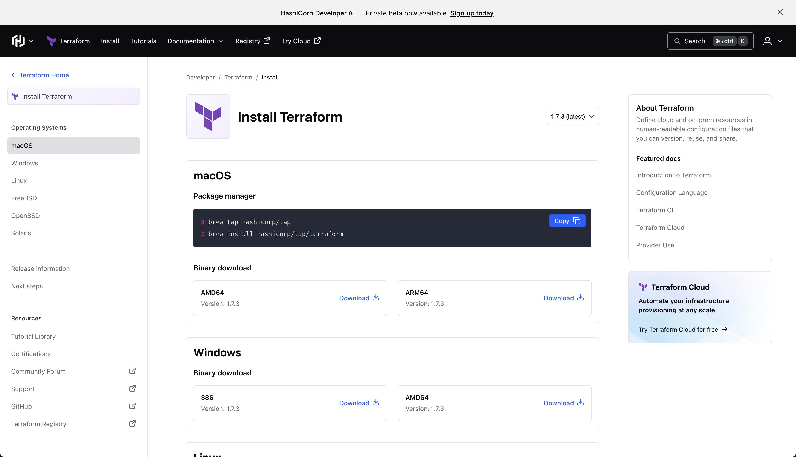

# Install Terraform

[Página oficial para Downloads](https://www.terraform.io/downloads.html)



## macOS

Package manager

```bash
✗ brew tap hashicorp/tap
✗ brew install hashicorp/tap/terraform
```

Binary Download

Fazer o Download do binário na página oficial e depois mover para a pasta `usr/local/bin`

```bash
✗ mv ~/Downloads/terraform /usr/local/bin/terraform
```

## Verificar versão instalada via BREW

```bash
✗ terraform --version
    Terraform v1.7.3
    on darwin_arm64
```

## Windows Binary

- 386 - Version: 1.7.3 -> [Download](https://releases.hashicorp.com/terraform/1.7.3/terraform_1.7.3_windows_386.zip)

- AMD64 - Version: 1.7.3 -> [Download](https://releases.hashicorp.com/terraform/1.7.3/terraform_1.7.3_windows_amd64.zip)

## Linux - Package manager

### Ubuntu/Debian

```bash
wget -O- https://apt.releases.hashicorp.com/gpg | sudo gpg --dearmor -o /usr/share/keyrings/hashicorp-archive-keyring.gpg
echo "deb [signed-by=/usr/share/keyrings/hashicorp-archive-keyring.gpg] https://apt.releases.hashicorp.com $(lsb_release -cs) main" | sudo tee /etc/apt/sources.list.d/hashicorp.list
sudo apt update && sudo apt install terraform
```

### CentOS/RHEL

```bash
sudo yum install -y yum-utils
sudo yum-config-manager --add-repo https://rpm.releases.hashicorp.com/RHEL/hashicorp.repo
sudo yum -y install terraform
```

### Fedora

```bash
sudo dnf install -y dnf-plugins-core
sudo dnf config-manager --add-repo https://rpm.releases.hashicorp.com/fedora/hashicorp.repo
sudo dnf -y install terraform
```

### Amazon Linux

```bash
sudo yum install -y yum-utils shadow-utils
sudo yum-config-manager --add-repo https://rpm.releases.hashicorp.com/AmazonLinux/hashicorp.repo
sudo yum -y install terraform
```

### Binary download

Fazer o download do binário e depois mover para a pasta /usr/local/bin/

```bash
mv ~/Downloads/terraform /usr/local/bin/terraform
```

### Verificar o PATH

```bash
echo $PATH
/usr/local/bin:/usr/bin:/bin:/usr/sbin:/sbin:/usr/local/go/bin:/Library/Apple/usr/bin
```

### Verificar versão instalada via binary

```bash
✗ terraform --version
    Terraform v1.7.3
    on darwin_arm64
```
